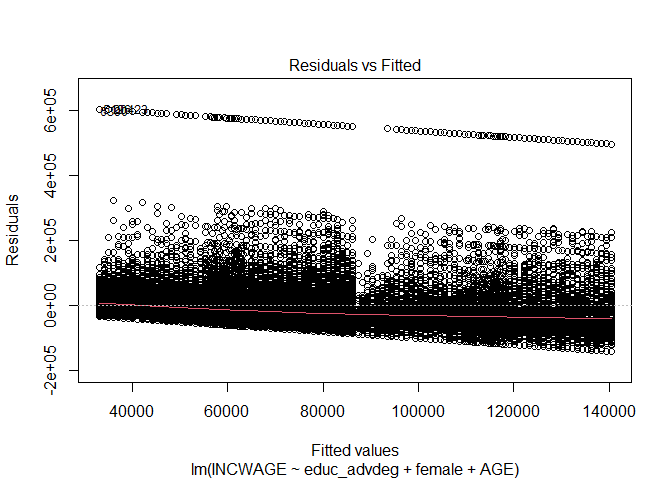

Homework\#4
================
Tamires Amorim, Yamei Li and Meirou Guan and Carol-Ann Jackson
10/11/2020

#### Homework 4

Linear Regression Exercise:

The following is interested in finding the relationship between wage and
women with higher academic degree level, the goal is to understand if
their advanced degree explains their wages.

Second we defined the subgroup, limiting the research for ages between
25 and 55 years old, currently working, and worked last year from 48 to
52 weeks intervalled, and working hours greater or equal to 35 hours per
week.

``` r
attach(acs2017_ny)
```

    ## The following object is masked from package:survival:
    ## 
    ##     veteran

``` r
use_varb <- (AGE >= 25) & (AGE <= 55) & (LABFORCE == 2) & (WKSWORK2 > 4) & (UHRSWORK >= 35)
dat_use <- subset(acs2017_ny,use_varb) 
attach(dat_use)
```

    ## The following objects are masked from acs2017_ny:
    ## 
    ##     AfAm, AGE, Amindian, ANCESTR1, ANCESTR1D, ANCESTR2, ANCESTR2D,
    ##     Asian, below_150poverty, below_200poverty, below_povertyline, BPL,
    ##     BPLD, BUILTYR2, CITIZEN, CLASSWKR, CLASSWKRD, Commute_bus,
    ##     Commute_car, Commute_other, Commute_rail, Commute_subway, COSTELEC,
    ##     COSTFUEL, COSTGAS, COSTWATR, DEGFIELD, DEGFIELD2, DEGFIELD2D,
    ##     DEGFIELDD, DEPARTS, EDUC, educ_advdeg, educ_college, educ_hs,
    ##     educ_nohs, educ_somecoll, EDUCD, EMPSTAT, EMPSTATD, FAMSIZE,
    ##     female, foodstamps, FOODSTMP, FTOTINC, FUELHEAT, GQ,
    ##     has_AnyHealthIns, has_PvtHealthIns, HCOVANY, HCOVPRIV, HHINCOME,
    ##     Hisp_Cuban, Hisp_DomR, Hisp_Mex, Hisp_PR, HISPAN, HISPAND,
    ##     Hispanic, in_Bronx, in_Brooklyn, in_Manhattan, in_Nassau, in_NYC,
    ##     in_Queens, in_StatenI, in_Westchester, INCTOT, INCWAGE, IND,
    ##     LABFORCE, LINGISOL, MARST, MIGCOUNTY1, MIGPLAC1, MIGPUMA1,
    ##     MIGRATE1, MIGRATE1D, MORTGAGE, NCHILD, NCHLT5, OCC, OWNCOST,
    ##     OWNERSHP, OWNERSHPD, POVERTY, PUMA, PWPUMA00, RACE, race_oth,
    ##     RACED, RELATE, RELATED, RENT, ROOMS, SCHOOL, SEX, SSMC, TRANTIME,
    ##     TRANWORK, UHRSWORK, UNITSSTR, unmarried, veteran, VETSTAT,
    ##     VETSTATD, white, WKSWORK2, YRSUSA1
    ## 
    ## The following object is masked from package:survival:
    ## 
    ##     veteran

Now we want to perform a linear regression to determine the coefficients
of a linear model, in our specific case we want to predict the wage as
explained by female education, here we included age to have a defined
age group in the analysis. Using the lm function we have:

``` r
fit <- lm(INCWAGE ~  educ_advdeg + female + AGE, data = acs2017_ny)
```

Now we wanted to plot the variables to observe if there is a linear
relation between the variables. The plot for female wages seems
extremely odd and for now I do not have any reasonable explanations for
that shape.

``` r
plot(INCWAGE ~ educ_advdeg + female + AGE , col=2)
```

<!-- --><!-- -->

``` r
abline(fit,col=3,lwd=2)
```

    ## Warning in abline(fit, col = 3, lwd = 2): only using the first two of 4
    ## regression coefficients

``` r
bs <- round(coef(fit), 3)
lmlab <- paste0("INCWAGE = ", bs[1],
 ifelse(sign(bs[2])==1, " + ", " - "), abs(bs[2]), " educ_advdeg ")
mtext(lmlab, 3, line=-2)
```

<!-- -->

Now we want to visualize the output and understand the relation the
variables hold:

``` r
model_temp1 <- lm(INCWAGE ~ educ_advdeg + female + AGE, family = binomial, data = dat_use)
```

    ## Warning: In lm.fit(x, y, offset = offset, singular.ok = singular.ok, ...) :
    ##  extra argument 'family' will be disregarded

``` r
summary(model_temp1)
```

    ## 
    ## Call:
    ## lm(formula = INCWAGE ~ educ_advdeg + female + AGE, data = dat_use, 
    ##     family = binomial)
    ## 
    ## Residuals:
    ##     Min      1Q  Median      3Q     Max 
    ## -140397  -35987  -14457   12900  604907 
    ## 
    ## Coefficients:
    ##              Estimate Std. Error t value Pr(>|t|)    
    ## (Intercept)  30576.29    1718.39   17.79   <2e-16 ***
    ## educ_advdeg  54256.02     905.34   59.93   <2e-16 ***
    ## female      -22740.13     738.10  -30.81   <2e-16 ***
    ## AGE           1010.27      40.33   25.05   <2e-16 ***
    ## ---
    ## Signif. codes:  0 '***' 0.001 '**' 0.01 '*' 0.05 '.' 0.1 ' ' 1
    ## 
    ## Residual standard error: 79270 on 46967 degrees of freedom
    ## Multiple R-squared:  0.09334,    Adjusted R-squared:  0.09328 
    ## F-statistic:  1612 on 3 and 46967 DF,  p-value: < 2.2e-16

``` r
plot(model_temp1)
```

<!-- --><!-- --><!-- --><!-- -->

``` r
require(stargazer)
stargazer(model_temp1, type = "text")
```

    ## 
    ## ================================================
    ##                         Dependent variable:     
    ##                     ----------------------------
    ##                               INCWAGE           
    ## ------------------------------------------------
    ## educ_advdeg                54,256.020***        
    ##                              (905.339)          
    ##                                                 
    ## female                     -22,740.130***       
    ##                              (738.103)          
    ##                                                 
    ## AGE                         1,010.266***        
    ##                               (40.332)          
    ##                                                 
    ## Constant                   30,576.290***        
    ##                             (1,718.385)         
    ##                                                 
    ## ------------------------------------------------
    ## Observations                   46,971           
    ## R2                             0.093            
    ## Adjusted R2                    0.093            
    ## Residual Std. Error   79,267.750 (df = 46967)   
    ## F Statistic         1,611.745*** (df = 3; 46967)
    ## ================================================
    ## Note:                *p<0.1; **p<0.05; ***p<0.01

Stargaze give us the summary of the data:

1.  The estimated slope of each coefficient:

<!-- end list -->

1)  Educ\_advdeg and the y-intercept, which suggests the best fit
    prediction of wage is (-36377.764) + 4428.513 \* educ\_advdeg

2)  Female and the y-intecept, which suggests the best fit prediction of
    wage is (-36377.764) + (-16450.841)\*female \#\#\#\#this does not
    make sense

3)  Age and the y-intercept, which suggests the best fit prediction of
    wage is (-36377.764) + (-110.985)\*AGE

<!-- end list -->

2.  The p-value of each coefficient, which suggests that the intercept
    and education are probably not due to chance, the p-value less than
    0.01 under normal circumstances mean that there is substantial
    evidence against the null hypothesis.

3.  Overall estimates of fit such as r-squared and adjusted r-squared,
    which shows how much of the variation in wage is explained by the
    model.

<!-- end list -->

``` r
# subset in order to plot...
NNobs <- length(INCWAGE)
set.seed(12345) # just so you can replicate and get same "random" choices
graph_obs <- (runif(NNobs) < 0.1) # so something like just 1/10 as many obs
dat_graph <-subset(dat_use,graph_obs)  

plot(INCWAGE ~ jitter(AGE, factor = 2), pch = 16, col = rgb(0.5, 0.5, 0.5, alpha = 0.2), data = dat_graph)
```

<!-- -->

``` r
plot(INCWAGE ~ jitter(AGE, factor = 2), pch = 16, col = rgb(0.5, 0.5, 0.5, alpha = 0.2), ylim = c(0,150000), data = dat_graph)
# discus what you see in this plot

# change this line to fit your regression
to_be_predicted2 <- data.frame(AGE = 25:55, female = 0, educ_advdeg = 0)
to_be_predicted2$yhat <- predict(model_temp1, newdata = to_be_predicted2)

lines(yhat ~ AGE, data = to_be_predicted2)
```

<!-- -->

``` r
NNobs <- length(INCWAGE)
set.seed(12345) # just so you can replicate and get same "random" choices
graph_obs <- (runif(NNobs) < 0.1) # so something like just 1/10 as many obs
dat_graph <-subset(dat_use,graph_obs)  

plot(INCWAGE ~ jitter(female, factor = 2), pch = 16, col = rgb(0.5, 0.5, 0.5, alpha = 0.2), data = dat_graph)
```

<!-- -->

``` r
plot(INCWAGE ~ jitter(female, factor = 2), pch = 16, col = rgb(0.5, 0.5, 0.5, alpha = 0.2), ylim = c(0,150000), data = dat_graph)
# discus what you see in this plot

# change this line to fit your regression
to_be_predicted2 <- data.frame(AGE = 25:55, female = 1, educ_advdeg = 1)
to_be_predicted2$yhat <- predict(model_temp1, newdata = to_be_predicted2)

lines(yhat ~ female, data = to_be_predicted2)
```

<!-- -->

``` r
detach()
```
